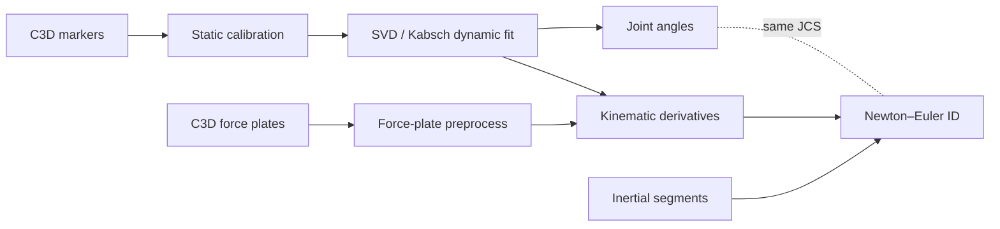

# Lower-body motion capture: IK → kinetics pipeline

**End-to-end processing from raw laboratory C3D files to time series of joint angles and intersegmental moments for a pelvis-to-foot chain** — modular Python scripts, intermediate NPZ/CSV artifacts, static calibration, Grood–Suntay knee conventions, and force-plate preprocessing aligned to the kinematic frame rate.

### IK results

Right-leg walking trial: 3D marker animation (segment ACS fit) synchronized with hip / knee / ankle angle time series (Grood–Suntay knee FE & var–val, ISB-style hip and ankle).

<p align="center">
  
</p>

*Files: [`reports/figures/IK_results.gif`](IK_results.gif) — update from e.g. `Downloads/IK results.gif` if you re-record.*

### Inverse dynamics (ID)

Ground-reaction–based Newton–Euler moments at the ankle (PF/DF) and knee (FE, abduction/adduction in Grood–Suntay JCS), with markers and a moving time cursor.

<p align="center">
  
</p>

*Files: [`reports/figures/ID.gif`](ID.gif) — update from `Downloads/ID.gif` if needed.*

---

## Poster

**Inverse kinematics and dynamics pipeline** — slide-style summary (Figs. 4–5: joint angles and joint moments during walk, with literature framing).

<p align="center">
  
</p>

*Image: [`reports/figures/poster_inverse_kinematics_dynamics.png`](reports/figures/poster_inverse_kinematics_dynamics.png). Replace this file if you export a higher-resolution poster. Optional: add a print-quality PDF (e.g. `reports/Inverse-Kinematics-and-Dynamics-Pipeline.pdf`) and link it here.*

### Acknowledgments (from poster)

- Dr. Fiorentino  
- NIH NIAMS R21AR077371  
- S. Kohbandeloo  

---

## Comparison to literature

Text aligned with the poster’s interpretation and citations.

**Inverse kinematics**

Joint physiologic patterns are **consistent with gait literature**; **knee flexion during stance (~10–20°)** aligns with reported ranges [4].

**Inverse dynamics**

Joint moments are described on the poster as falling **within ACLR-relevant ranges**: **knee moments ~0.3–0.5 Nm/kg** and **ankle plantarflexion ~1.2–1.4 Nm/kg** [4]. (Values are trial- and normalization-dependent; use your exported curves and cohort for formal study claims.)

---

## Results (quick read)

- **IK (kinematics):** GIF above; interactive exports include `Walk_R04_angles_right.html` and bilateral chain NPZ from [`svd_kabsch.py`](scripts/static%20calib/svd_kabsch.py).
- **ID (kinetics):** GIF above; QC PDFs via [`plot_inverse_dynamics_qc.py`](scripts/static%20calib/plot_inverse_dynamics_qc.py) and HTML viewers under `scripts/static calib/subject 02 - S_Cal02/`.

---

## Pipeline / methods (brief)



| Stage | Role |
|--------|------|
| **Static calibration** | ACS templates, joint centers — [`static_calibration.py`](scripts/static%20calib/static_calibration.py) |
| **Dynamic IK** | Per-frame rigid fit — [`svd_kabsch.py`](scripts/static%20calib/svd_kabsch.py) |
| **Angles** | Hip / knee (Grood–Suntay) / ankle — [`angles_only.py`](scripts/static%20calib/angles_only.py), [`joint_angles.py`](scripts/static%20calib/joint_angles.py) |
| **Filtering → COM kinematics** | Low-pass kinematics, COM/joint acceleration, ω, α — [`kinematic_derivatives.py`](scripts/static%20calib/kinematic_derivatives.py) |
| **Force plates** | GRF, **COP** — [`forceplate_preprocess.py`](scripts/static%20calib/forceplate_preprocess.py) |
| **Inertia** | Scaled segment properties — [`inertial_segments.py`](scripts/static%20calib/inertial_segments.py) |
| **ID** | Newton–Euler chain — [`inverse_dynamics_newton_euler.py`](scripts/static%20calib/inverse_dynamics_newton_euler.py) |

**Solver:** Rigid-body **Newton–Euler** inverse dynamics with GRF at **COP** on the instrumented foot, propagated proximally with consistent segment ACS and documented sign conventions.

---

## Full technical report

- **[`reports/lower_body_pipeline_report.tex`](reports/lower_body_pipeline_report.tex)** — *Lower-Body Biomechanics Pipeline for Kinematic and Kinetic Analysis from Raw Marker Data* (methods, testing, equations by module).

Companion LaTeX:

- **[`reports/multibody final`](reports/multibody%20final)** — *ACS-Based Inverse Kinematics and Inverse Dynamics for Bilateral Gait Analysis* (rename to `.tex` locally if your editor requires it).

**Build (example):**

```bash
cd reports
pdflatex lower_body_pipeline_report.tex
```

---

## References

Publications cited on the poster / in the pipeline narrative:

1. Wu, G. et al. (2002). ISB recommendation on definitions of joint coordinate systems of various joints for the reporting of human joint motion—Part II: hip, knee, ankle. *Journal of Biomechanics*, 35(4).  
2. Kabsch, W. (1976). A solution for the best rotation to relate two sets of vectors. *Acta Crystallographica Section A*, 32(5).  
3. Winter, D. A. (2009). *Biomechanics and Motor Control of Human Movement* (4th ed.). Wiley.  
4. Khandha, A. et al. (2025). *Journal of Biomechanics* — cited on the poster for gait / ACLR-relevant angle and moment ranges (see comparison section above).

---

## Repository layout (high level)

| Path | Purpose |
|------|---------|
| `c3d/` | Raw / organized C3D and GRF exports |
| `scripts/static calib/` | Main pipeline scripts, subject folders, NPZ/HTML outputs |
| `reports/` | LaTeX reports, poster image |

**Author:** Luke Camarao — University of Vermont, Biomedical Engineering (see report title pages for mentor and date).
