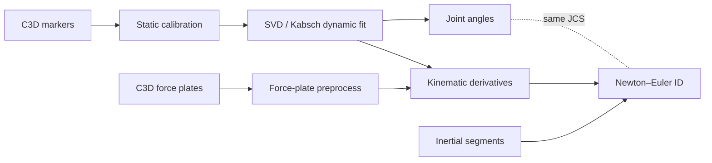
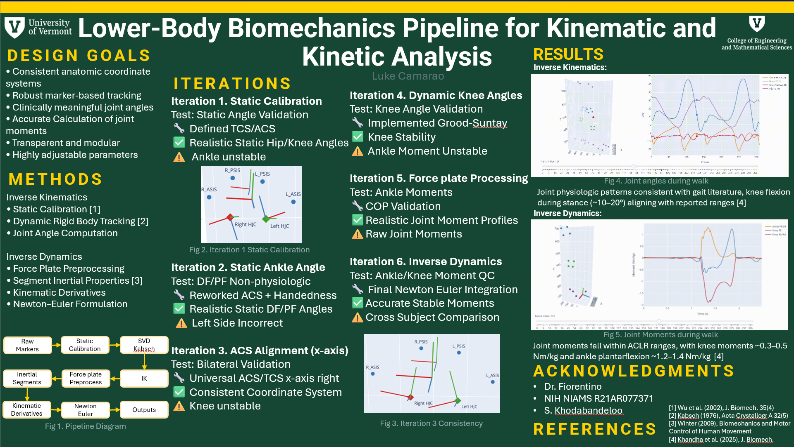

# Lower-body motion capture: IK → kinetics pipeline

**End-to-end processing from raw laboratory C3D files to time series of joint angles and intersegmental moments for a pelvis-to-foot chain** — modular Python scripts, intermediate NPZ/CSV artifacts, static calibration, Grood–Suntay knee conventions, and force-plate preprocessing aligned to the kinematic frame rate.

### IK results

Right-leg walking trial: 3D marker animation (segment ACS fit) synchronized with hip / knee / ankle angle time series (Grood–Suntay knee FE & var–val, ISB-style hip and ankle).


*Place the GIF at [`reports/figures/IK.gif`](reports/figures/IK.gif) on branch `main` (e.g. copy from `Downloads/IK results.gif`).*

### Inverse dynamics (ID)

Same trial class: ground-reaction–based Newton–Euler moments at the ankle (PF/DF) and knee (FE, abduction/adduction in Grood–Suntay JCS), shown with markers and a moving time cursor.


*Place the GIF at [`reports/figures/ID.gif`](reports/figures/ID.gif) on branch `main` (e.g. copy from `Downloads/ID.gif`).*

---

## Results (quick read)

- **IK (kinematics):** See the **IK results** GIF above; pipeline code in [`src/svd_kabsch.py`](src/svd_kabsch.py) (and related modules in [`src/`](src/)); trial exports (HTML/NPZ) live in your subject folders or under `reports/` as you prefer.
- **ID (kinetics):** See the **ID** GIF above; QC plotting in [`src/plot_inverse_dynamics_qc.py`](src/plot_inverse_dynamics_qc.py); moment solvers in [`src/inverse_dynamics_newton_euler.py`](src/inverse_dynamics_newton_euler.py).

### Comparison to literature (poster)

- **Inverse kinematics:** Joint physiologic patterns consistent with gait literature; **knee flexion during stance (~10–20°)** aligns with reported ranges [4].
- **Inverse dynamics:** Joint moments fall within **ACLR** reporting ranges: **knee** ~**0.3–0.5 Nm/kg**, **ankle plantarflexion** ~**1.2–1.4 Nm/kg** [4].

**Reference:** [4] Khandha et al. (2025), *Journal of Biomechanics* (poster Fig. 4–5 captions).

---

## Pipeline / methods (brief)



**Stages (bullets):**

| Stage | Role |
|--------|------|
| **Static calibration** | Anatomical coordinate systems (ACS), joint-center templates — [`src/static_calibration.py`](src/static_calibration.py) |
| **Dynamic IK** | Rigid body fit per frame, bilateral segment rotations — [`src/svd_kabsch.py`](src/svd_kabsch.py) |
| **Angles** | Hip / knee (Grood–Suntay) / ankle — [`src/angles_only.py`](src/angles_only.py), [`src/joint_angles.py`](src/joint_angles.py) |
| **Filtering → COM kinematics** | Low-pass kinematics, COM/joint linear acceleration, segment ω and α — [`src/kinematic_derivatives.py`](src/kinematic_derivatives.py) |
| **Force plates** | GRF, **COP**, optional export NPZ aligned to marker trials — [`src/forceplate_preprocess.py`](src/forceplate_preprocess.py) |
| **Inertia** | Scaled segment mass, COM offset, principal inertias — [`src/inertial_segments.py`](src/inertial_segments.py) |
| **ID** | Foot wrench + bottom-up shank/thigh; knee moments in Grood–Suntay JCS — [`src/inverse_dynamics_newton_euler.py`](src/inverse_dynamics_newton_euler.py) |

**Solver:** Rigid-body **Newton–Euler** inverse dynamics with ground reaction **force** at **center of pressure (COP)** on the instrumented foot, propagated proximally with consistent segment ACS and documented sign conventions.

---

## Poster

Poster PNG lives under **`reports/`** on branch **`main`** (GitHub root: `README.md`, `src/`, `reports/`). Raw URL pattern:

`https://raw.githubusercontent.com/<username>/<repo>/main/reports/poster.png`



Replace **`reports/poster.png`** when you export a higher-resolution slide; keep the same path so this README link stays valid.

**Acknowledgments (as on poster):** Dr. Fiorentino; NIH NIAMS **R21AR077371**; S. Kohbandeloo.

**References (poster):** [1] Wu et al. (2002), *J. Biomech.* 35(4); [2] Kabsch (1976), *Acta Crystallogr. A* 32(5); [3] Winter (2009), *Biomechanics and Motor Control of Human Movement*; [4] Khandha et al. (2025), *J. Biomech.*

---

## Full technical report

Primary write-up (compile to PDF):

- **[`reports/lower_body_pipeline_report.tex`](reports/lower_body_pipeline_report.tex)** — *Lower-Body Biomechanics Pipeline for Kinematic and Kinetic Analysis from Raw Marker Data* (methods, testing, equations by module).

```bash
cd reports
pdflatex lower_body_pipeline_report.tex
```

---

## Repository layout

Matches the **default branch `main`** tree on GitHub (`README.md`, top-level folders only):

| Path | Purpose |
|------|---------|
| **`README.md`** | This overview (embedded media use paths under `reports/`) |
| **`src/`** | Python pipeline — calibration, SVD/Kabsch, angles, GRF/COP, kinematic derivatives, inertia, Newton–Euler ID, QC plots |
| **`reports/`** | LaTeX (`lower_body_pipeline_report.tex`), **`poster.png`**, and **`figures/`** (e.g. `IK.gif`, `ID.gif` for the README) |

*A larger local checkout may still include `c3d/`, subject folders, and NPZ/HTML outputs; those are optional and not required for this slim repo layout.*

**Author:** Luke Camarao — University of Vermont, Biomedical Engineering (see report title pages for mentor and date).
