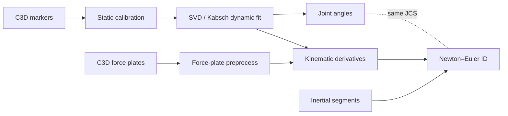

# Lower-body motion capture: IK → kinetics pipeline

**End-to-end processing from raw laboratory C3D files to time series of joint angles and intersegmental moments for a pelvis-to-foot chain** — modular Python scripts, intermediate NPZ/CSV artifacts, static calibration, Grood–Suntay knee conventions, and force-plate preprocessing aligned to the kinematic frame rate.


*Hero figure: add `reports/figures/ankle_knee_moments.png` (e.g. export from `scripts/static calib/plot_inverse_dynamics_qc.py` or screenshot from `Walk_R04_ankle_knee_moment_viewer.html`).*

---

## Results (quick read)

- **Joint moments:** Ankle and knee traces (lab and JCS where applicable) from Newton–Euler inverse dynamics with GRF at COP; QC plots via [`plot_inverse_dynamics_qc.py`](scripts/static%20calib/plot_inverse_dynamics_qc.py) (PDF bundle) and interactive HTML under `scripts/static calib/subject 02 - S_Cal02/`.
- **Kinematics:** Segment ACS fitting and joint angles — e.g. `Walk_R04_angles_right.html`, bilateral chain NPZ outputs from [`svd_kabsch.py`](scripts/static%20calib/svd_kabsch.py).

**Interpretation (example framing):** For a representative level-walking trial, ankle plantarflexor moment tends to peak in late stance and the knee extension–moment profile shows a mid-stance–biased pattern, consistent with typical sagittal walking kinetics — useful as a sanity check before study-specific claims (e.g. post-ACLR loading comparisons would tie wording to your cohort).

---

## Pipeline / methods (brief)



**Stages (bullets):**

| Stage | Role |
|--------|------|
| **Static calibration** | Anatomical coordinate systems (ACS), joint-center templates — [`static_calibration.py`](scripts/static%20calib/static_calibration.py) |
| **Dynamic IK** | Rigid body fit per frame, bilateral segment rotations — [`svd_kabsch.py`](scripts/static%20calib/svd_kabsch.py) |
| **Angles** | Hip / knee (Grood–Suntay) / ankle — [`angles_only.py`](scripts/static%20calib/angles_only.py), [`joint_angles.py`](scripts/static%20calib/joint_angles.py) |
| **Filtering → COM kinematics** | Low-pass kinematics, COM/joint linear acceleration, segment ω and α — [`kinematic_derivatives.py`](scripts/static%20calib/kinematic_derivatives.py) |
| **Force plates** | GRF, **COP**, optional export NPZ aligned to marker trials — [`forceplate_preprocess.py`](scripts/static%20calib/forceplate_preprocess.py) |
| **Inertia** | Scaled segment mass, COM offset, principal inertias — [`inertial_segments.py`](scripts/static%20calib/inertial_segments.py) |
| **ID** | Foot wrench + bottom-up shank/thigh; knee moments in Grood–Suntay JCS — [`inverse_dynamics_newton_euler.py`](scripts/static%20calib/inverse_dynamics_newton_euler.py) |

**Solver:** Rigid-body **Newton–Euler** inverse dynamics with ground reaction **force** at **center of pressure (COP)** on the instrumented foot, propagated proximally with consistent segment ACS and documented sign conventions.

---

## Full technical report (poster)

Primary write-up (compile to PDF):

- **[`reports/lower_body_pipeline_report.tex`](reports/lower_body_pipeline_report.tex)** — *Lower-Body Biomechanics Pipeline for Kinematic and Kinetic Analysis from Raw Marker Data* (methods, testing, equations by module).

Companion / earlier narrative (LaTeX source):

- **[`reports/multibody final`](reports/multibody%20final)** — LaTeX source (no `.tex` suffix in repo); *ACS-Based Inverse Kinematics and Inverse Dynamics for Bilateral Gait Analysis*. Rename/copy to `multibody_final.tex` locally if your editor requires the extension.

**Build (example):**

```bash
cd reports
pdflatex lower_body_pipeline_report.tex
```

Add a built PDF to the repo or release (e.g. `reports/Inverse-Kinematics-and-Dynamics-Pipeline.pdf`) and link it here for a one-click **“Full technical report (poster)”** download.

---

## Repository layout (high level)

| Path | Purpose |
|------|---------|
| `c3d/` | Raw / organized C3D and GRF exports |
| `scripts/static calib/` | Main pipeline scripts, subject folders, NPZ/HTML outputs |
| `reports/` | LaTeX reports |

**Author:** Luke Camarao — University of Vermont, Biomedical Engineering (see report title pages for mentor and date).
