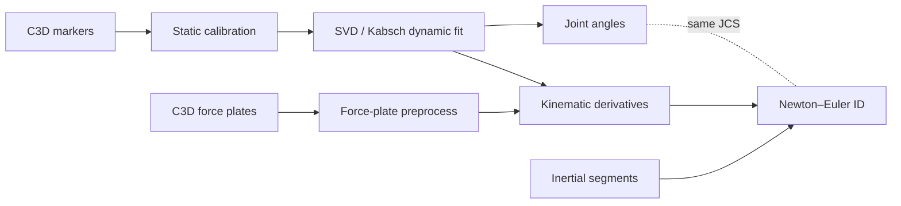

# Lower-body motion capture: IK → kinetics pipeline

**End-to-end processing from raw laboratory C3D files to time series of joint angles and intersegmental moments for a pelvis-to-foot chain** — modular Python scripts, intermediate NPZ/CSV artifacts, static calibration, Grood–Suntay knee conventions, and force-plate preprocessing aligned to the kinematic frame rate.

*GitHub layout:* [`src/`](src/) holds the pipeline Python modules; [`reports/`](reports/) holds the LaTeX report, poster PNG, and other figures. If you still develop under `scripts/static calib/` locally, mirror or symlink that tree into `src/` before pushing so these links resolve on **main**.

### IK results

Right-leg walking trial: 3D marker animation (segment ACS fit) synchronized with hip / knee / ankle angle time series (Grood–Suntay knee FE & var–val, ISB-style hip and ankle).


*Source files live in the repo as [`reports/IK_results.gif`](IK.gif) (update by copying from e.g. `Downloads/IK results.gif` if you re-record).

### Inverse dynamics (ID)

Same trial class: ground-reaction–based Newton–Euler moments at the ankle (PF/DF) and knee (FE, abduction/adduction in Grood–Suntay JCS), shown with markers and a moving time cursor.


*Source: [`reports/ID.gif`](ID.gif) (e.g. sync from `Downloads/ID.gif`).*

---

## Results (quick read)

- **IK (kinematics):** See the **IK results** GIF above; interactive exports include `Walk_R04_angles_right.html` and bilateral chain NPZ from [`svd_kabsch.py`](src/svd_kabsch.py).
- **ID (kinetics):** See the **ID** GIF above; QC PDFs via [`plot_inverse_dynamics_qc.py`](src/plot_inverse_dynamics_qc.py) and HTML viewers under `src/subject 02 - S_Cal02/` (e.g. ankle/knee moment dashboards).

### Comparison to literature (poster)

- **Inverse kinematics:** Joint physiologic patterns consistent with gait literature; **knee flexion during stance (~10–20°)** aligns with reported ranges [4].
- **Inverse dynamics:** Joint moments fall within **ACLR** reporting ranges: **knee** ~**0.3–0.5 Nm/kg**, **ankle plantarflexion** ~**1.2–1.4 Nm/kg** [4].

**Reference:** [4] Khandha et al. (2025), *Journal of Biomechanics* (poster Fig. 4–5 captions).

---

## Pipeline / methods (brief)



**Stages (bullets):**

| Stage | Role |
|--------|------|
| **Static calibration** | Anatomical coordinate systems (ACS), joint-center templates — [`static_calibration.py`](src/static_calibration.py) |
| **Dynamic IK** | Rigid body fit per frame, bilateral segment rotations — [`svd_kabsch.py`](src/svd_kabsch.py) |
| **Angles** | Hip / knee (Grood–Suntay) / ankle — [`angles_only.py`](src/angles_only.py), [`joint_angles.py`](src/joint_angles.py) |
| **Filtering → COM kinematics** | Low-pass kinematics, COM/joint linear acceleration, segment ω and α — [`kinematic_derivatives.py`](src/kinematic_derivatives.py) |
| **Force plates** | GRF, **COP**, optional export NPZ aligned to marker trials — [`forceplate_preprocess.py`](src/forceplate_preprocess.py) |
| **Inertia** | Scaled segment mass, COM offset, principal inertias — [`inertial_segments.py`](src/inertial_segments.py) |
| **ID** | Foot wrench + bottom-up shank/thigh; knee moments in Grood–Suntay JCS — [`inverse_dynamics_newton_euler.py`](src/inverse_dynamics_newton_euler.py) |

**Solver:** Rigid-body **Newton–Euler** inverse dynamics with ground reaction **force** at **center of pressure (COP)** on the instrumented foot, propagated proximally with consistent segment ACS and documented sign conventions.

---

## Poster

PNG on the default branch **`main`** at [`reports/poster.png`](reports/poster.png) (matches the public repo layout). Raw URL:

`https://raw.githubusercontent.com/lukecamarao/Inverse-Kinematics-and-Dynamics-Pipeline/main/reports/poster.png`


Overwrite **`reports/poster.png`** when you export a higher-resolution slide; keep the same path so this README and the raw link stay valid.

**Acknowledgments (as on poster):** Dr. Fiorentino; NIH NIAMS **R21AR077371**; S. Kohbandeloo.

**References (poster):** [1] Wu et al. (2002), *J. Biomech.* 35(4); [2] Kabsch (1976), *Acta Crystallogr. A* 32(5); [3] Winter (2009), *Biomechanics and Motor Control of Human Movement*; [4] Khandha et al. (2025), *J. Biomech.*

---

## Full technical report

Primary write-up (compile to PDF):

- **[`reports/lower_body_pipeline_report.tex`](reports/lower_body_pipeline_report.tex)** — *Lower-Body Biomechanics Pipeline for Kinematic and Kinetic Analysis from Raw Marker Data* (methods, testing, equations by module).

```bash
cd reports
pdflatex lower_body_pipeline_report.tex
```

---

## Repository layout (GitHub `main`)

Matches the public repo root: **`README.md`**, **`src/`**, **`reports/`**.

| Path | Purpose |
|------|---------|
| [`src/`](src/) | Pipeline Python modules (static calibration → Kabsch → angles → kinematic derivatives → force plate → inertia → Newton–Euler ID); example trial HTML/NPZ under subject folders when committed |
| [`reports/`](reports/) | [`lower_body_pipeline_report.tex`](reports/lower_body_pipeline_report.tex), **[`poster.png`](reports/poster.png)** (README figure above), and other report assets |
| `IK.gif`, `ID.gif` | Demo animations linked at the top of this README (keep at repo root next to `README.md`, or move both + update the two `` lines) |

Raw C3D and large trial data often stay **local only** (not in the GitHub tree); adjust paths in your scripts accordingly.

**Author:** Luke Camarao — University of Vermont, Biomedical Engineering (see report title pages for mentor and date).
